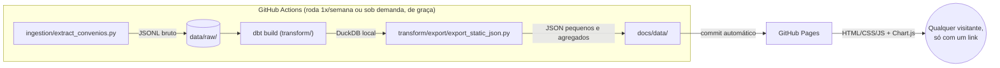

# br-public-spending-pipeline

**Pra onde vai o dinheiro dos convênios do Governo Federal com estados e municípios — atualizado sozinho, todo mundo pode ver, ninguém paga nada.**

Este projeto baixa dados públicos do [Portal da Transparência](https://portaldatransparencia.gov.br/), organiza tudo com boas práticas de engenharia de dados, e publica um painel estático que qualquer pessoa acessa só com um link — sem instalar programa, sem criar conta, sem servidor rodando o tempo todo.

**🔗 Site ao vivo:** https://dexcarva.github.io/br-public-spending-pipeline/
*(fica no ar depois que o GitHub Pages processa o primeiro deploy e o workflow de dados roda pela primeira vez — veja "Como a automação funciona" mais abaixo)*

Este README é intencionalmente longo e explica o **porquê** de cada decisão, não só o *como* rodar — esse é o objetivo didático do projeto: qualquer pessoa lendo o código (ou este arquivo) deveria sair entendendo não só "o que" foi feito, mas por que foi feito assim.

## Por que essa arquitetura (e não Docker + Airflow + Postgres + Streamlit)

A ideia original de um pipeline de dados "de livro-texto" seria: Docker orquestrando containers de Airflow (orquestração), PostgreSQL (banco) e Streamlit (visualização). É uma stack ótima pra aprender conceitos de plataforma de dados corporativa — mas ela tem um problema fatal pro objetivo deste projeto: **para qualquer pessoa ver o resultado, ela precisaria rodar esses containers na própria máquina.** Isso é o oposto de "qualquer um, sem gastar nada, sem instalar nada".

Em vez disso, este projeto separa duas coisas que normalmente ficam grudadas:

1. **Processar o dado** — feito periodicamente, na nuvem, de graça.
2. **Consumir o dado** — um site estático que qualquer navegador abre.

| Peça do pipeline "clássico" | Aqui vira | Por quê |
|---|---|---|
| Docker | nada (não existe container) | O único lugar onde código roda é o runner do GitHub Actions, que já vem pronto — não precisa provisionar nada |
| Airflow | GitHub Actions com `cron` (`.github/workflows/update-data.yml`) | Mesma ideia (agendar + rodar um pipeline), sem precisar de um servidor de orquestração de pé 24h |
| PostgreSQL | [DuckDB](https://duckdb.org/) | Banco analítico que roda **dentro do processo Python**, como se fosse um arquivo — não existe "instalar o banco", só existe abrir um arquivo `.duckdb` |
| Streamlit (app com servidor) | HTML + CSS + JavaScript puro, com [Chart.js](https://www.chartjs.org/) | Não precisa de servidor rodando pra sempre — o "app" é só arquivos estáticos que o [GitHub Pages](https://pages.github.com/) serve de graça |

E o que **não** mudou em relação à ideia original: ainda existe uma ingestão com paginação e retry, ainda existe uma modelagem em camadas com [dbt](https://www.getdbt.com/) (staging → dimensões → fato), e ainda existem testes automáticos de qualidade de dado. A engenharia de dados "de verdade" continua toda lá — só o *onde* ela roda que mudou.

## Arquitetura



Cada seta desse diagrama é um arquivo real neste repositório — não é um diagrama conceitual, é literalmente o que roda.

## De onde vêm os dados

A fonte é a [API de Dados do Portal da Transparência](https://portaldatransparencia.gov.br/api-de-dados), especificamente o endpoint `/api-de-dados/convenios`.

**O que é um convênio:** o instrumento jurídico que o Governo Federal usa pra repassar dinheiro a estados, municípios e outras entidades pra executar um projeto específico (uma obra, um programa de saúde, etc.).

**Por que esse endpoint e não outro:** a API tem dezenas de endpoints, mas boa parte deles (ex.: parcelas do Bolsa Família por município) exige informar o código IBGE de **um** município por chamada — cobrir os ~5.570 municípios do Brasil exigiria milhares de requisições só pra um mês de um programa. O endpoint de convênios, ao contrário, aceita um intervalo de datas e devolve convênios de todos os municípios e órgãos nesse intervalo, paginado — o que permite manter o pipeline rápido e dentro do limite de requisições da API (documentado como 90 requisições/minuto em horário comercial, com suspensão de 8h se ultrapassar) rodando de graça no GitHub Actions.

**Limitação honesta:** convênio é *um* instrumento de repasse entre vários que existem (tem também transferências constitucionais, emendas parlamentares, etc.). Este painel não representa o gasto público total — representa os convênios, que já são um recorte relevante e informativo por si só.

## Estrutura do repositório

```
ingestion/
  extract_convenios.py     # chama a API, pagina, retry/backoff, salva data/raw/convenios.jsonl
transform/                 # projeto dbt
  dbt_project.yml
  profiles.yml              # aponta pra um arquivo .duckdb local — sem servidor
  models/
    staging/                # achata o JSON bruto, corrige tipos (dbt: camada "staging")
    marts/dimensions/        # dim_municipio, dim_orgao_superior
    marts/facts/             # fct_convenios
    marts/schema.yml         # testes de qualidade (not_null, unique, etc.)
  tests/                     # teste customizado: valor de convênio nunca é negativo
  export/export_static_json.py  # lê o resultado do dbt, gera os JSON do site
docs/                       # é isso que o GitHub Pages publica
  index.html
  css/style.css
  js/app.js                  # busca os JSON, desenha os gráficos (Chart.js)
  data/                      # kpis.json, ranking_orgaos.json, serie_temporal.json, municipios.json
.github/workflows/update-data.yml   # o "orquestrador": roda tudo isso 1x/semana
```

## Rodando localmente

Precisa só de Python 3.11+ — nada de Docker, nada de instalar banco de dados.

```bash
pip install -r requirements.txt
```

### 1. Conseguir uma chave da API (grátis, leva menos de 1 minuto)

Cadastre seu e-mail em **https://portaldatransparencia.gov.br/api-de-dados/cadastrar-email** — a chave chega por e-mail. Depois:

```bash
# Linux/macOS
export PORTAL_TRANSPARENCIA_API_KEY="sua-chave-aqui"

# Windows (PowerShell)
$env:PORTAL_TRANSPARENCIA_API_KEY = "sua-chave-aqui"
```

### 2. Rodar o pipeline, passo a passo

```bash
# 1) Ingestão: baixa os convênios dos últimos 24 meses (janela configurável,
#    veja as env vars no topo de ingestion/extract_convenios.py) em data/raw/.
python ingestion/extract_convenios.py

# 2) Transformação: roda os models do dbt (staging -> dimensões -> fato) e os
#    testes de qualidade de dado, tudo dentro de um arquivo DuckDB local.
cd transform
dbt build --profiles-dir .
cd ..

# 3) Export: gera os JSON agregados que o site consome, em docs/data/.
python transform/export/export_static_json.py
```

### 3. Ver o site

Navegadores bloqueiam `fetch()` de arquivos abertos direto (`file://`) por segurança — então sirva a pasta `docs/` com um servidor HTTP simples:

```bash
cd docs
python -m http.server 8000
```

Abra **http://localhost:8000** no navegador.

## Como a automação funciona (`.github/workflows/update-data.yml`)

Uma vez por semana (e também sob demanda, pela aba *Actions* do GitHub → "Atualizar dados de convênios" → *Run workflow*), o GitHub roda os mesmos 3 passos acima numa máquina temporária, e depois commita os JSON atualizados de volta na branch `main`. O GitHub Pages, configurado pra servir a pasta `docs/` dessa branch, republica o site sozinho sempre que esses arquivos mudam.

### Configurando num fork/cópia deste repositório

1. **Gerar a chave da API** (mesmo passo do "rodando localmente" acima).
2. **Adicionar a chave como secret do repositório**: Settings → Secrets and variables → Actions → *New repository secret* → nome `PORTAL_TRANSPARENCIA_API_KEY`, valor a chave recebida por e-mail.
3. **Habilitar o GitHub Pages**: Settings → Pages → Build and deployment → Source: *Deploy from a branch* → Branch: `main`, pasta `/docs`.
4. **Disparar a primeira execução**: aba Actions → "Atualizar dados de convênios" → *Run workflow* (não precisa esperar a segunda-feira). Depois disso, o cron semanal mantém tudo atualizado sozinho.

## Qualidade de dado (o "data contract")

O checklist original deste projeto pedia explicitamente testes de qualidade — eles estão em `transform/models/marts/schema.yml` (chaves primárias únicas e não-nulas nas dimensões, chaves estrangeiras não-nulas na fato) e em `transform/tests/assert_valor_convenio_nao_negativo.sql` (um teste customizado: gasto público não pode ser negativo). Rodando `dbt build`, esses testes falham **visivelmente** no log do GitHub Actions se algum dado vier fora do esperado — em vez de um número errado aparecer silenciosamente no site.

## Licença

Veja [LICENSE](LICENSE). Os dados em si são públicos, sob responsabilidade da Controladoria-Geral da União (CGU).
