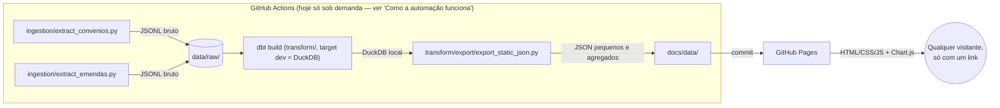
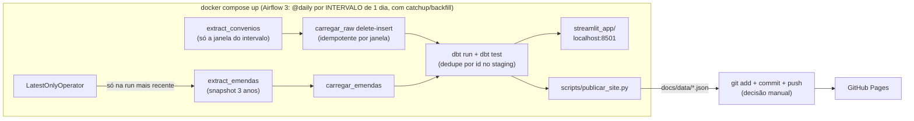

# br-public-spending-pipeline

**Pra onde vai o dinheiro público federal — convênios com estados/municípios e emendas parlamentares — atualizado sozinho, todo mundo pode ver, ninguém paga nada.**

Este projeto baixa dados públicos do [Portal da Transparência](https://portaldatransparencia.gov.br/), organiza tudo com boas práticas de engenharia de dados, e publica um painel estático que qualquer pessoa acessa só com um link — sem instalar programa, sem criar conta, sem servidor rodando o tempo todo.

**🔗 Site ao vivo:** https://dexcarva.github.io/br-public-spending-pipeline/
*(fica no ar depois que o GitHub Pages processa o primeiro deploy e o workflow de dados roda pela primeira vez — veja "Como a automação funciona" mais abaixo)*

Este README é intencionalmente longo e explica o **porquê** de cada decisão, não só o *como* rodar — esse é o objetivo didático do projeto: qualquer pessoa lendo o código (ou este arquivo) deveria sair entendendo não só "o que" foi feito, mas por que foi feito assim.

## Por que DUAS arquiteturas (o site estático E a stack Docker/Airflow/Postgres/Streamlit)

Este repositório contém, de propósito, **dois mundos completos que compartilham o mesmo código de ingestão e os mesmos models dbt** — e a história de por que os dois existem ensina mais engenharia de dados que qualquer um deles sozinho.

**Mundo 1 — o site estático (a vitrine).** A ideia original de um pipeline "de livro-texto" seria Docker orquestrando Airflow (orquestração), PostgreSQL (banco) e Streamlit (visualização). Ótima pra aprender plataforma de dados corporativa — mas com um problema fatal pro objetivo público do projeto: **pra qualquer pessoa ver o resultado, ela precisaria rodar containers na própria máquina.** O oposto de "qualquer um, sem gastar nada, sem instalar nada". Por isso o consumo é um site estático:

| Peça do pipeline "clássico" | No site estático vira | Por quê |
|---|---|---|
| Docker | nada (não existe container) | O único lugar onde código roda é o runner do GitHub Actions, que já vem pronto |
| Airflow | GitHub Actions com `cron` | Mesma ideia (agendar + rodar um pipeline), sem servidor de orquestração de pé 24h |
| PostgreSQL | [DuckDB](https://duckdb.org/) | Banco analítico que roda **dentro do processo Python** — "instalar o banco" é abrir um arquivo `.duckdb` |
| Streamlit (app com servidor) | HTML + CSS + JavaScript puro, com [Chart.js](https://www.chartjs.org/) | O "app" é só arquivos estáticos que o [GitHub Pages](https://pages.github.com/) serve de graça |

**Mundo 2 — a stack Docker local (a cozinha).** Aí a realidade deu aula: rodando contra a API de verdade, **o volume de dados estourou o tempo de job do GitHub Actions** (uma janela de 14 dias trouxe ~12.000 convênios e levou 48 minutos — a janela padrão de 3 meses não cabe em runner gratuito nenhum). A ingestão pesada precisava de um lugar sem limite de tempo: a máquina local. E se ia existir processamento local de qualquer jeito, valia fazê-lo com a stack clássica completa — Airflow orquestrando, Postgres armazenando, Streamlit visualizando, Docker empacotando tudo — que é exatamente o que uma avaliação técnica de engenharia de dados quer ver funcionando.

**A ponte entre os dois mundos é um único ponto:** `scripts/publicar_site.py` escreve os mesmos `docs/data/*.json` que o site estático consome. Rodou a DAG localmente → conferiu no Streamlit → `git add docs/data && git commit && git push` → o site público atualiza. Nenhum outro acoplamento existe.

E o que é igual nos dois mundos (de propósito): a mesma ingestão com paginação e retry (`ingestion/`), a mesma modelagem em camadas com [dbt](https://www.getdbt.com/) (staging → dimensões → fato) e os mesmos testes de qualidade — os models rodam idênticos no DuckDB e no Postgres, só a camada de staging sabe de qual fonte bruta ler (ver o bloco condicional por `target.type` em `transform/models/staging/`).

## Arquitetura

**Mundo 1 — site estático (consumo público):**



**Mundo 2 — stack Docker local (laboratório completo, incremental):**



Cada seta desses diagramas é um arquivo real neste repositório — não é um diagrama conceitual, é literalmente o que roda.

## De onde vêm os dados

A fonte é a [API de Dados do Portal da Transparência](https://portaldatransparencia.gov.br/api-de-dados). O pipeline consome dois endpoints, tratados como duas fontes independentes (ingestão, modelagem e seção do site separadas para cada uma — não existe uma chave confiável pra juntar as duas num dataset só):

### Convênios (`/api-de-dados/convenios`)

**O que é um convênio:** o instrumento jurídico que o Governo Federal usa pra repassar dinheiro a estados, municípios e outras entidades pra executar um projeto específico (uma obra, um programa de saúde, etc.).

**Por que esse endpoint e não outro:** a API tem dezenas de endpoints, mas boa parte deles (ex.: parcelas do Bolsa Família por município) exige informar o código IBGE de **um** município por chamada — cobrir os ~5.570 municípios do Brasil exigiria milhares de requisições só pra um mês de um programa. O endpoint de convênios, ao contrário, aceita um intervalo de datas e devolve convênios de todos os municípios e órgãos nesse intervalo, paginado — o que permite manter o pipeline rápido e dentro do limite de requisições da API (documentado como 90 requisições/minuto em horário comercial, com suspensão de 8h se ultrapassar) rodando de graça no GitHub Actions.

### Emendas parlamentares (`/api-de-dados/emendas`)

**O que é uma emenda parlamentar:** o mecanismo pelo qual um deputado, senador, bancada estadual ou comissão do Congresso destina uma fatia do orçamento federal a uma finalidade específica. É o dado que liga "político" a "dinheiro público" de forma direta.

**O ciclo orçamentário** (a fonte real dos números "proposto" e "executado" — não são categorias que inventamos, são os 3 estágios formais que todo gasto público federal passa antes de sair do caixa):

| Estágio | Campo na API | O que significa |
|---|---|---|
| 1. Empenho | `valorEmpenhado` | O parlamentar reserva/destina o valor — o mais próximo de "proposto". |
| 2. Liquidação | `valorLiquidado` | Comprovação de que o bem/serviço foi entregue. |
| 3. Pagamento | `valorPago` | O dinheiro efetivamente sai do caixa do governo — o mais próximo de "executado". |
| (cancelamento) | `valorRestoCancelado` | Valor empenhado e depois formalmente **cancelado** — prometido e nunca virou nada. |

A métrica central do painel, **taxa de execução = pago ÷ empenhado**, vem direto desses campos oficiais. Não inventamos um "score de impacto" — impacto social de um projeto não dá pra medir só com valor financeiro, e o painel não finge que dá.

**Cuidado de justiça aplicado no código:** nem todo `autor` de emenda é uma pessoa — existem emendas de bancada estadual (coletiva, todos os deputados de um estado) e de comissão/relator. O campo `tipoEmenda` é preservado e exposto (`dim_autor_emenda.eh_parlamentar_individual`) pra essas entidades coletivas não aparecerem misturadas num "ranking de políticos" como se fossem uma pessoa só — o site mostra só emendas individuais por padrão, com opção de incluir as coletivas.

**Limitação honesta desse endpoint:** a API não devolve um identificador estável (CPF, ID de parlamentar) pro autor, só o nome em texto — então o agrupamento por parlamentar depende do nome vir escrito de forma consistente na fonte. Nomes de deputados/senadores federais raramente colidem na prática, mas isso é uma limitação da fonte de dados, não uma garantia matemática de unicidade.

### O que este painel não cobre

Convênios e emendas são dois entre vários instrumentos de repasse do governo (existem outros, como transferências constitucionais). Isto não é o gasto público total.

### ⚠️ Aviso sobre completude e precisão (importa de verdade)

Este é um projeto independente de visualização de dados públicos — **não é uma publicação oficial** do Governo Federal. **O histórico exibido pode estar incompleto**: a ingestão cobre janelas limitadas de tempo, o filtro temporal da fonte se comporta de forma não-determinística (documentado em detalhe nos comentários de `airflow/dags/pipeline_gastos_publicos.py`), e a própria fonte atualiza valores retroativamente — pagamentos, cancelamentos e restos a pagar mudam depois da publicação. Os números podem não refletir o estado oficial mais recente e **não devem ser usados como fonte única** para decisões, denúncias ou conclusões definitivas sobre qualquer pessoa ou órgão. Uma taxa de execução baixa tem explicações legítimas (restos a pagar atravessam anos-exercício, por exemplo) e não implica, por si só, qualquer irregularidade. Para dados oficiais e completos, consulte o [Portal da Transparência (CGU)](https://portaldatransparencia.gov.br/). O mesmo aviso aparece no rodapé do site e do painel Streamlit.

## Estrutura do repositório

```
ingestion/                 # COMPARTILHADO pelos dois mundos
  portal_transparencia.py  # cliente HTTP compartilhado: autenticação, retry/backoff, rate limit
  extract_convenios.py     # pagina por intervalo de datas, salva data/raw/convenios.jsonl
  extract_emendas.py       # pagina por ano, salva data/raw/emendas.jsonl
transform/                 # projeto dbt — COMPARTILHADO (mesmos models nos dois bancos)
  dbt_project.yml
  profiles.yml              # DOIS targets: dev (DuckDB local) e postgres (compose OU Neon — só env vars mudam)
  macros/normalizar_valor_brl.sql  # converte "1.234,56" (formato BR) pra decimal — SQL padrão, roda nos 2 bancos
  models/
    staging/                # achata o JSON bruto, corrige tipos; ÚNICA camada que sabe qual banco
                            # a alimenta (if target.type: read_json_auto no DuckDB, raw.* JSONB no Postgres)
    staging/sources.yml      # declara raw.convenios/raw.emendas como "source" (linhagem do dado bruto)
    marts/dimensions/        # dim_municipio, dim_orgao_superior, dim_autor_emenda
    marts/facts/             # fct_convenios, fct_emendas
    marts/schema.yml         # testes de qualidade (not_null, unique, etc.)
  tests/                     # testes customizados: valores nunca negativos
  export/export_static_json.py  # mundo 1: lê o DuckDB, gera os JSON do site
docs/                       # é isso que o GitHub Pages publica (mundo 1)
  index.html
  css/style.css
  js/app.js                  # busca os JSON, desenha os gráficos (Chart.js)
  data/                      # kpis.json, ranking_orgaos.json, serie_temporal.json, municipios.json,
                              # kpis_emendas.json, ranking_parlamentares.json
.github/workflows/update-data.yml   # mundo 1: o pipeline na nuvem (hoje só disparo manual — ver abaixo)

docker-compose.yml          # mundo 2: sobe Postgres + Airflow + Streamlit com um comando
docker/
  init-postgres.sql          # roda 1x na criação do banco: schema raw + banco de metadados do Airflow
  airflow/Dockerfile         # imagem oficial do Airflow + nossas deps (dbt isolado em venv próprio)
airflow/dags/
  pipeline_gastos_publicos.py  # a DAG: extração -> carga raw -> dbt run/test -> publicar site
scripts/
  carregar_raw_postgres.py   # carga em raw.* (JSONB): convênios INCREMENTAL (delete-insert por janela),
                              # emendas snapshot (truncar-e-recarregar) — a estratégia segue a natureza da fonte
  publicar_site.py           # a PONTE: consulta o Postgres e escreve os mesmos docs/data/*.json do site
streamlit_app/
  app.py                     # painel interativo lendo direto do Postgres (localhost:8501)
  Dockerfile
```

## Rodando localmente — mundo 1 (DuckDB, sem Docker)

Precisa só de Python 3.11+ — nada de Docker, nada de instalar banco de dados.

```bash
pip install -r requirements.txt
```

### 1. Conseguir uma chave da API (grátis, leva menos de 1 minuto)

Cadastre seu e-mail em **https://portaldatransparencia.gov.br/api-de-dados/cadastrar-email** — a chave chega por e-mail. Depois:

```bash
# Linux/macOS
export PORTAL_TRANSPARENCIA_API_KEY="sua-chave-aqui"

# Windows (PowerShell)
$env:PORTAL_TRANSPARENCIA_API_KEY = "sua-chave-aqui"
```

### 2. Rodar o pipeline, passo a passo

```bash
# 1) Ingestão: baixa convênios (últimos 24 meses) e emendas parlamentares
#    (últimos 3 anos) — janelas configuráveis via env vars, veja o topo de
#    cada script em ingestion/.
python ingestion/extract_convenios.py
python ingestion/extract_emendas.py

# 2) Transformação: roda os models do dbt (staging -> dimensões -> fato) e os
#    testes de qualidade de dado, tudo dentro de um arquivo DuckDB local.
cd transform
dbt build --profiles-dir .
cd ..

# 3) Export: gera os JSON agregados que o site consome, em docs/data/.
python transform/export/export_static_json.py
```

### 3. Ver o site

Navegadores bloqueiam `fetch()` de arquivos abertos direto (`file://`) por segurança — então sirva a pasta `docs/` com um servidor HTTP simples:

```bash
cd docs
python -m http.server 8000
```

Abra **http://localhost:8000** no navegador.

## Rodando localmente — mundo 2 (a stack Docker completa)

Precisa do [Docker Desktop](https://www.docker.com/products/docker-desktop/) (no Windows, ele instala/usa o WSL2 por baixo). Com ele instalado e o `.env` na raiz contendo sua `PORTAL_TRANSPARENCIA_API_KEY`:

```bash
docker compose up -d --build
```

Na primeira vez isso constrói as imagens e sobe 4 serviços (a ordem e as esperas entre eles já estão declaradas no compose):

| Serviço | Onde acessar | O que é |
|---|---|---|
| Postgres 15 | `localhost:5432` (user/senha/db: `gastos`) | O warehouse: schema `raw` (bruto JSONB) + `analytics_*` (models do dbt) |
| Airflow | http://localhost:8080 (admin / admin) | Orquestrador — a DAG `pipeline_gastos_publicos` roda `@daily` e aceita disparo manual |
| Streamlit | http://localhost:8501 | Painel interativo lendo o Postgres direto (KPIs, ranking, série temporal, filtro região→UF→município) |
| (airflow-init) | — | Roda uma vez e termina: cria as tabelas de metadados e o usuário admin |

Primeira execução recomendada: defina uma janela PEQUENA no `.env` (ex.: `CONVENIOS_DATA_INICIAL=01/07/2026` e `CONVENIOS_DATA_FINAL=05/07/2026`) e dispare a DAG manualmente na UI do Airflow — valida o caminho inteiro em minutos, em vez de horas. Depois remova as variáveis pra janela padrão de 3 meses (a execução completa leva horas por causa do rate limit da API — é exatamente o motivo de isso não rodar mais no GitHub Actions).

Pra publicar o resultado no site público depois que a DAG terminar (o único acoplamento entre os dois mundos — e é manual de propósito, publicar é decisão de gente):

```bash
git add docs/data && git commit -m "chore: atualiza dados" && git push
```

## Como a automação funciona (`.github/workflows/update-data.yml`)

O workflow é **incremental**: cada execução processa a janela de 1 dia (ontem, por padrão) e acumula o histórico num **Postgres gerenciado gratuito ([Neon](https://neon.tech))** — não no runner (descartável) nem no repositório (que incharia). Com isso a execução diária cabe em minutos no plano gratuito do Actions. A primeira versão deste workflow recarregava a janela inteira de 3 meses a cada run e não cabia no tempo de job — a lição (regime permanente deve custar O(dado novo), não O(janela)) virou o desenho atual, tanto aqui quanto na DAG local.

O disparo manual aceita uma **janela opcional** (inputs `data_inicial`/`data_final`), que é o mecanismo de backfill: pra carregar um período histórico, dispare informando as datas — a carga é delete-insert por janela, então repetir o mesmo período não duplica nada.

Pra ativar o cron diário num fork: crie o projeto no Neon (free tier), cadastre os secrets `POSTGRES_HOST/USER/PASSWORD/DB` (além do `PORTAL_TRANSPARENCIA_API_KEY`) e descomente o bloco `schedule` do workflow — as instruções estão comentadas no próprio arquivo. Os JSON commitados em `docs/data/` continuam sendo a única saída pro site; o GitHub Pages republica sozinho quando eles mudam — não importa se quem os commitou foi o workflow ou você, depois de rodar a DAG local.

### Configurando num fork/cópia deste repositório

1. **Gerar a chave da API** (mesmo passo do "rodando localmente" acima).
2. **Adicionar a chave como secret do repositório**: Settings → Secrets and variables → Actions → *New repository secret* → nome `PORTAL_TRANSPARENCIA_API_KEY`, valor a chave recebida por e-mail.
3. **Habilitar o GitHub Pages**: Settings → Pages → Build and deployment → Source: *Deploy from a branch* → Branch: `main`, pasta `/docs`.
4. **Disparar a primeira execução**: aba Actions → "Atualizar dados de convênios" → *Run workflow* — de preferência com uma janela pequena via env vars (o cron automático está desativado; ver a seção acima sobre o porquê). Pra volume completo, use a stack Docker local.

## Qualidade de dado (o "data contract")

O checklist original deste projeto pedia explicitamente testes de qualidade — eles estão em `transform/models/marts/schema.yml` (chaves primárias únicas e não-nulas nas dimensões, chaves estrangeiras não-nulas nas fatos) e nos testes customizados em `transform/tests/` (`assert_valor_convenio_nao_negativo.sql`, `assert_valor_empenhado_nao_negativo.sql`: gasto público não pode ser negativo). Rodando `dbt build`, esses testes falham **visivelmente** no log do GitHub Actions se algum dado vier fora do esperado — em vez de um número errado aparecer silenciosamente no site.

## Licença

Veja [LICENSE](LICENSE). Os dados em si são públicos, sob responsabilidade da Controladoria-Geral da União (CGU).
